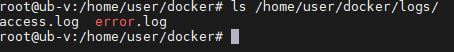

# Домашнее задание "Docker, dockerfile"

## Описание/Пошаговая инструкция выполнения домашнего задания:


1. Написать Dockerfile на базе apache/nginx который будет содержать две статичнце web-страницы
на разных портах. Например, 80 и 3000.
2. Пробросить эти порты на хост машину. Обе страницы должны быть доступны по адресам
localhost:80 и localhost:3000
3. Добавить 2 вольюма. Один для логов приложениā, другой для web-страниц.

### Создать свой кастомный образ nginx.

1. Сборка Dockerfile для nginx

```
FROM nginx
EXPOSE 80
EXPOSE 3000
RUN mkdir /usr/share/nginx/html3000 -p
RUN rm /etc/nginx/conf.d/default.conf
COPY default.conf /etc/nginx/conf.d
COPY index.html /usr/share/nginx/html3000
```
2. Создание Docker образа на основе Dockerfile

```
docker build -t mynxinx:nginx .
```

3. Стартует Docker контейнер с пробросом портов 80 и 3000 и монтирование папок  /usr/share/nginx/html и /var/log/nginx/

```
docker run -d -p 80:80 -p 3000:3000 -v /home/user/docker/www:/usr/share/nginx/html -v /home/user/docker/logs:/var/log/nginx/ mynxinx:nginx
```
4. Проверяем, что страницы откываются на разных портах


5. Проверяем, что файла доступны на хостовой машине




